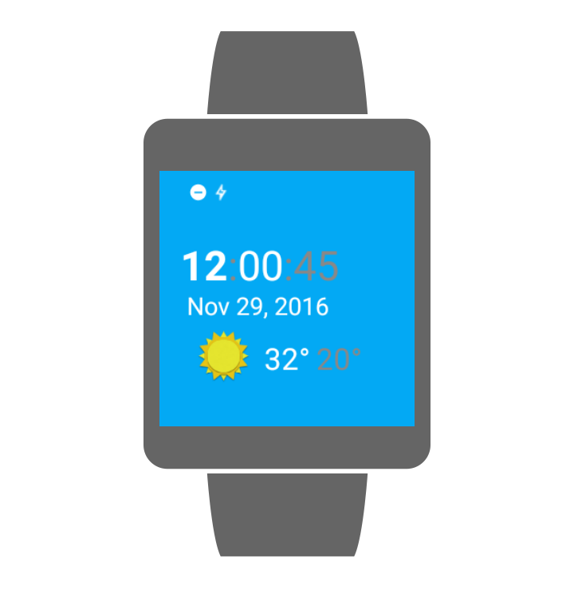

# Sunshine Wearable

Synchronizes weather information from OpenWeatherMap on Android Phones and Tablets. Used in the Udacity Advanced Android course.  
This is a part of the Android Developer Nanodegree for the creation of a watch face for the sunshine app to run on an Android Wear device.

## Getting Started
1. This sample uses the Gradle build system.  To build this project, use the "gradlew build" command or use "Import Project" in Android Studio.
2. Add your OpenWeatherMap API key to this [file](app/build.gradle). It can be obtained from [here](http://openweathermap.org/appid).
3. To connect the Android Wear device / emulator, follow the instructions [here](https://developer.android.com/training/wearables/apps/creating.html).

## Screenshot of Wear App

### Interactive Mode

### Ambient Mode

## Download
Download app from [here](https://github.com/DevipriyaSarkar/Sunshine-Wearable/releases).

## License
Copyright 2015 The Android Open Source Project, Inc.

Licensed to the Apache Software Foundation (ASF) under one or more contributor
license agreements.  See the NOTICE file distributed with this work for
additional information regarding copyright ownership.  The ASF licenses this
file to you under the Apache License, Version 2.0 (the "License"); you may not
use this file except in compliance with the License.  You may obtain a copy of
the License at

http://www.apache.org/licenses/LICENSE-2.0

Unless required by applicable law or agreed to in writing, software
distributed under the License is distributed on an "AS IS" BASIS, WITHOUT
WARRANTIES OR CONDITIONS OF ANY KIND, either express or implied.  See the
License for the specific language governing permissions and limitations under
the License.

